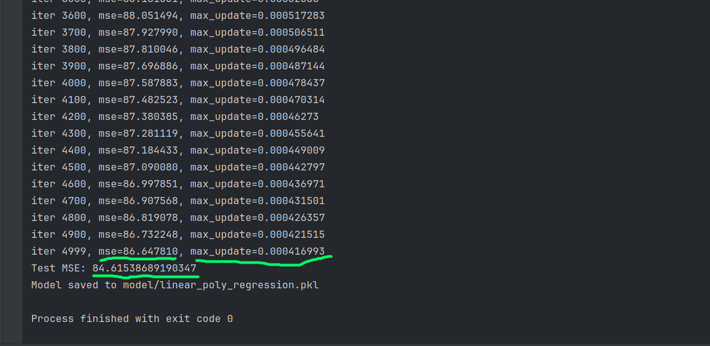

# Calories Burned Prediction - Manual ML Pipeline

This project implements a **Calories Burned Prediction** model from scratch using **Python OOP concepts**, **manual gradient descent**, and **manual preprocessing**.  
No external ML libraries (like scikit-learn or numpy) are used for the model computation — everything is built **from scratch**, making this a great demonstration of understanding ML fundamentals.

---

## **Project Structure**
```bash
calories-burn-prediction/ 
│
├─ data/ # CSV datasets
│ ├─ exercise.csv
│ └─ calories.csv
│
├─ model/ # Trained model saved with pickle
│
├─ src/
│ ├─ data_loader.py # Load CSV files and merge
│ ├─ preprocess.py # Data preprocessing (encoding, scaling, polynomial features)
│ ├─ model.py # Manual Linear Regression class
│ ├─ trainer.py # Training & evaluation logic
│ └─ utils.py # Utilities: MSE, train/test split, save/load model
│
├─ main.py # Run the full ML pipeline
├─ requirements.txt # Python requirements (minimal)
└─ README.md
```
---

## **Features**

- Manual preprocessing:
    - Gender encoding (`male → 0, female → 1`)
    - Feature scaling (mean & std, manual z-score)
    - Polynomial feature expansion (degree 2 & 3)
- Manual Linear Regression:
    - Dot product without libraries
    - Gradient descent with convergence check (epsilon)
    - Train & test split implemented manually
- Fully reproducible: `random_seed` ensures same results
- Model saving and loading using `pickle`

---

## **Installation**

1. Clone the repository:

```bash
git clone <your-repo-url>
cd calories-burn-prediction
```

Create virtual environment:

```bash
python -m venv .venv
source .venv/bin/activate  # Linux/macOS
.venv\Scripts\activate     # Windows
```

Install requirements (minimal):

```bash
pip install -r requirements.txt
```

## **Usage**

Place your datasets in the data/ folder:

exercise.csv and calories.csv

Run the main pipeline:

```bash
python main.py
```

Output:

- Training progress (MSE per iteration)
- Final Test MSE
- Model saved to model/linear_poly_regression.pkl

Optional: You can load the model for predictions:

```python
from src.utils import load_model

model = load_model("model/linear_poly_regression.pkl")
y_pred = model.predict(X_new)  # X_new: manually prepared input
```

## Results (Example)
* Full pipeline training MSE: 86.65
* Test MSE: 84.61
* Model saved to model/linear_poly_regression.pkl

## Training Screenshot




